# LOCK GRAPH & DEADLOCK AUDIT — Im_player

> **Phạm vi:** phân tích toàn bộ source trong `src(20260816-084507).zip`, tập trung vào `mutex`, `shared_mutex`, `recursive_mutex`, `condition_variable`, `join()`, callback dưới lock, lock ordering và các đường dẫn có thể tạo deadlock/hang.
>
> **Mức độ tin cậy:** đây là **static audit**. Các deadlock phụ thuộc runtime/callback ngoài source không thể khẳng định 100% nếu chưa instrument lock acquisition thực tế. Những mục được đánh dấu **CRITICAL / HIGH** là các đường dẫn cần sửa trước.

---

# 1. Executive Summary

Hệ thống hiện tại có nhiều mutex nhưng vấn đề chính **không phải số lượng mutex**, mà là:

1. Có code gọi hàm bên ngoài khi đang giữ mutex.
2. Có callback được gọi khi đang giữ mutex.
3. Có `join()` khi đang giữ mutex.
4. Có nhiều subsystem có mutex riêng nhưng **chưa có lock ordering toàn hệ thống**.
5. Một số API trả pointer/reference sau khi nhả mutex, tạo lifetime race.
6. `WindowManager`, `PlayerManager`, `ConfigManager` đều đang trộn **state protection + object lifetime + callback/orchestration** vào cùng một lock.
7. `recursive_mutex` đang được dùng để che giấu lock recursion thay vì giải quyết lock hierarchy.
8. `condition_variable` nhìn chung được sử dụng đúng kiểu RAII, nhưng shutdown/lifecycle của một số thread vẫn có khả năng tạo hang.
9. `ThreadManager::JoinAllRegistered()` có lỗi thiết kế deadlock rất rõ: giữ `mutex_` trong lúc `join()`.

### Các điểm nguy hiểm nhất

| ID | Vị trí | Mức độ | Vấn đề |
|---|---|---:|---|
| DG-01 | `ThreadManager::JoinAllRegistered()` | **CRITICAL** | Giữ `mutex_` rồi `join()` worker |
| DG-02 | `ConfigManager::Notify()` | **CRITICAL** | Callback được gọi khi giữ `rwMutex` |
| DG-03 | `WindowManager::QueueCreateWindow()` | **HIGH** | `onCreated()` được gọi khi giữ `m_windowsMutex` |
| DG-04 | `PlayerManager::CreateSession()` | **HIGH** | Giữ `m_sessionsMutex` trong toàn bộ `PlayerSession::Init()` |
| DG-05 | `PlayerManager::DestroySession()` | **HIGH** | Giữ `m_sessionsMutex` trong destructor/Shutdown của Session |
| DG-06 | `WindowManager::DestroyWindow()` | **HIGH** | Giữ `m_windowsMutex` trong recursive destroy + destructor |
| DG-07 | `FontManager::GetSystemFontSet()` | **HIGH** | Giữ `m_mutex` trong khi gọi `EnsureFontDataLoaded()`; hàm này hiện không lock → race, nếu thêm lock sẽ self-deadlock |
| DG-08 | `ShaderManager::ApplyPipeline()` | **MEDIUM/HIGH** | Giữ `recursive_mutex` trong filesystem + `mpv_command()` + `SaveState()` |
| DG-09 | `UIRenderThread::Run()` | **MEDIUM** | Giữ `m_mutex` trong graphics operation |
| DG-10 | `APIManager::SetProviderState()` | **MEDIUM** | Gọi provider code trong lúc giữ queue mutex |
| DG-11 | `PlayerStateSystem::*` | **MEDIUM** | Callback chạy trực tiếp dưới state lock |
| DG-12 | `WindowRuntime::CaptureSnapshot()` | **MEDIUM** | Copy state dưới lock an toàn, nhưng mọi callback/constructor tương lai bên trong snapshot phải tránh re-entry |
| DG-13 | `PlayBackRenderThread` lifecycle | **MEDIUM** | `join()` đúng thứ tự hiện tại nhưng phải kiểm tra mọi destructor/lifecycle caller |
| DG-14 | `UIRenderThread` / render lifecycle | **MEDIUM** | shutdown phụ thuộc atomic `m_running`, nhưng cần kiểm soát object lifetime |

---

# 2. Lock Inventory

Các lock chính phát hiện trong project:

```text
M_API_QUEUE
M_YOUTUBE_SERVICE
M_FONT
M_WINDOW_MANAGER
M_WINDOW_QUEUE
M_WINDOW_STATE
M_WINDOW_FRAME_SYNC
M_PROPERTY_BAG
M_UI_RENDER
M_RENDER_THREAD
M_PLAYER_MANAGER
M_PLAYER_STATE_PLAYBACK
M_PLAYER_STATE_MEDIA
M_PLAYER_STATE_VIDEO
M_PLAYER_STATE_AUDIO
M_PLAYER_STATE_SUBTITLE
M_PLAYER_STATE_TRACK
M_PLAYER_STATE_PLAYLIST
M_PLAYER_STATE_NETWORK
M_SETTINGS
M_THREAD_MANAGER
M_SHADER
M_AUDIO_RING
M_AUDIO_LIFECYCLE
M_COMMAND
M_EVENT_QUEUE
M_RETRY
```

Trong đó các lock có ảnh hưởng lớn đến toàn hệ thống:

```text
M_THREAD_MANAGER
       |
       +---- Thread lifecycle

M_WINDOW_MANAGER
       |
       +---- WindowRuntime lifetime
       +---- Window creation/destruction

M_WINDOW_STATE
       |
       +---- Win32/SDL event
       +---- UI thread
       +---- main thread
       +---- rendering

M_PLAYER_MANAGER
       |
       +---- PlayerSession lifetime

M_PLAYER_STATE_*
       |
       +---- MPV observer
       +---- UI
       +---- audio
       +---- command

M_SETTINGS
       |
       +---- UI
       +---- callbacks

M_SHADER
       |
       +---- MPV
       +---- filesystem
       +---- shader state

M_FONT
       |
       +---- Font discovery
       +---- ImGui/font initialization
```

---

# 3. Tổng quan Lock Graph

Lock graph cấp cao:

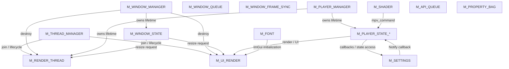

Điểm cần lưu ý:

> Mũi tên trên đây chưa phải tất cả lock-order edges. Nó thể hiện quan hệ subsystem/lifecycle. Lock-order thực tế nguy hiểm xuất hiện khi một node đang **giữ lock** rồi gọi sang node khác.

---

# 4. DEADLOCK CRITICAL — ThreadManager

## File

```text
src/threads/thread_manager.cpp
```

## Code nguy hiểm

```cpp
void ThreadManager::JoinAllRegistered() {
    std::lock_guard<std::mutex> lock(mutex_);

    for (auto& [id, info] : registeredThreads_) {
        if (info.threadPtr && info.threadPtr->joinable()) {
            info.threadPtr->join();
        }
    }

    registeredThreads_.clear();
}
```

Đây là deadlock pattern kinh điển:

```text
Main Thread
    |
    | lock(M_THREAD_MANAGER)
    |
    +---- join(Render Thread)
              |
              | Render Thread cần
              |
              +---- ThreadManager::Unregister()
                         |
                         | lock(M_THREAD_MANAGER)
                         |
                         X BLOCK
```

Lock graph:

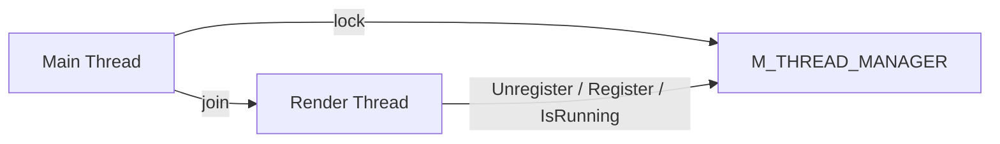

Chu trình:

```text
M_THREAD_MANAGER
        ↓
      join()
        ↓
Render Thread
        ↓
M_THREAD_MANAGER
```

Đây là **cycle thực sự**.

### Kết luận

**CRITICAL — phải sửa ngay.**

### Thiết kế đúng

Không bao giờ giữ `ThreadManager::mutex_` trong lúc `join()`.

```cpp
void ThreadManager::JoinAllRegistered() {
    std::vector<std::thread*> threads;

    {
        std::lock_guard<std::mutex> lock(mutex_);

        for (auto& [id, info] : registeredThreads_) {
            if (info.threadPtr && info.threadPtr->joinable()) {
                threads.push_back(info.threadPtr);
            }
        }
    }

    for (auto* thread : threads) {
        if (thread && thread->joinable()) {
            thread->join();
        }
    }

    {
        std::lock_guard<std::mutex> lock(mutex_);
        registeredThreads_.clear();
    }
}
```

Nguyên tắc:

```text
LOCK
  ↓
COPY POINTERS / STATE
  ↓
UNLOCK
  ↓
JOIN
  ↓
LOCK
  ↓
ERASE
```

---

# 5. DEADLOCK CRITICAL — ConfigManager callback dưới lock

## File

```text
src/settings_manager.h
```

## Code

```cpp
void Notify(ConfigGroup group) {
    std::shared_lock lock(rwMutex);

    for (const auto& callback : listeners) {
        if (callback)
            callback(group);
    }
}
```

Đây là thiết kế rất nguy hiểm.

Ví dụ callback:

```cpp
ConfigManager::Instance().RegisterListener(
    [](ConfigGroup group) {
        ConfigManager::Instance().UpdateVideoSettings(
            [](AppSettings& s) {
                // ...
            }
        );
    }
);
```

Luồng:

```text
UpdateVideoSettings()
    |
    +-- lock(M_SETTINGS WRITE)
    |
    +-- unlock
    |
    +-- Notify()
          |
          +-- lock(M_SETTINGS READ)
          |
          +-- callback()
                 |
                 +-- UpdateVideoSettings()
                        |
                        +-- lock(M_SETTINGS WRITE)
```

Graph:

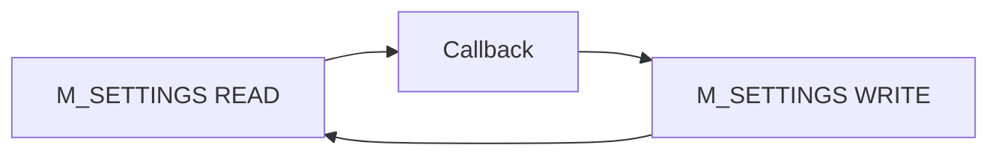

Đặc biệt nguy hiểm vì callback có thể:

```text
GetVideoSettings()
UpdateVideoSettings()
UpdateCommonSettings()
RegisterListener()
SaveVideo()
SaveCommon()
```

### Thiết kế đúng

Copy callback list trước:

```cpp
void Notify(ConfigGroup group) {
    std::vector<ConfigChangedCallback> callbacks;

    {
        std::shared_lock lock(rwMutex);
        callbacks = listeners;
    }

    for (auto& callback : callbacks) {
        if (callback) {
            callback(group);
        }
    }
}
```

Lock graph sau refactor:

```text
M_SETTINGS
   |
   +-- copy listeners
   |
UNLOCK
   |
callback()
```

Không còn:

```text
M_SETTINGS → callback → M_SETTINGS
```

---

# 6. DEADLOCK HIGH — WindowManager::QueueCreateWindow

## File

```text
src/windows/WindowManager.h
```

Code:

```cpp
std::lock_guard<std::mutex> lock(m_windowsMutex);

windows[newId] = std::unique_ptr<WindowRuntime>(runtime);

if (onCreated) {
    onCreated(newId);
}
```

`onCreated()` chạy khi `m_windowsMutex` vẫn đang bị giữ.

Callback có thể rất dễ gọi:

```cpp
GetWindowById()
GetAllWindows()
GetMainWindow()
DestroyWindow()
GetWindowFromEvent()
```

Tất cả đều có khả năng lock:

```text
M_WINDOW_MANAGER
```

Ví dụ:

```text
ProcessCreationQueue()
    |
    +-- lock(M_WINDOW_MANAGER)
    |
    +-- onCreated()
           |
           +-- GetWindowById()
                  |
                  +-- lock(M_WINDOW_MANAGER)
                         |
                         X DEADLOCK
```

Graph:

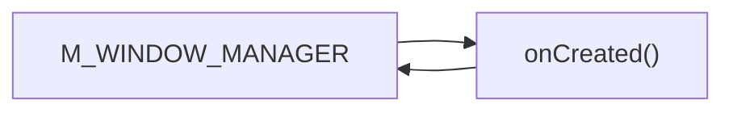

### Severity

**HIGH**

### Fix

Callback phải chạy sau unlock:

```cpp
WindowId newId = 0;

{
    std::lock_guard<std::mutex> lock(m_windowsMutex);
    windows[newId] = std::unique_ptr<WindowRuntime>(runtime);
}

if (onCreated) {
    onCreated(newId);
}
```

---

# 7. DEADLOCK HIGH — PlayerManager::CreateSession

## File

```text
src/player/session/PlayerManager.cpp
```

Code:

```cpp
std::lock_guard<std::mutex> lock(m_sessionsMutex);

auto session = std::make_unique<PlayerSession>(sessionId);

if (session->Init(runtime)) {
    ...
}
```

Vấn đề:

```text
PlayerSession::Init()
```

không phải operation nội bộ đơn giản.

Nó khởi tạo:

```text
Player
PlayBackRender
PlayBackRenderThread
Audio
PlaybackCommand
PlayBackProperty
AudioFilterManager
ShaderManager
PlaybackObserver
```

Một lock lifetime manager đang bao phủ gần như toàn bộ quá trình khởi tạo.

Graph tiềm năng:

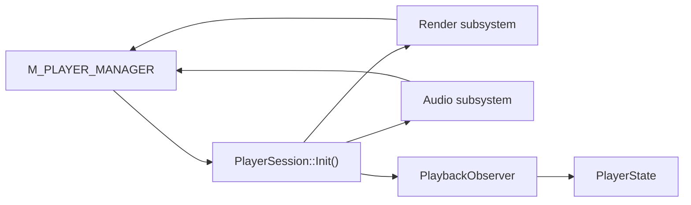

Nếu bất kỳ subsystem nào trong initialization callback quay lại:

```cpp
PlayerManager::GetSession()
PlayerManager::GetDefaultSession()
PlayerManager::GetRenderer()
...
```

sẽ tạo:

```text
M_PLAYER_MANAGER
    ↓
PlayerSession::Init
    ↓
PlayerManager
    ↓
M_PLAYER_MANAGER
```

### Khuyến nghị

Không giữ `m_sessionsMutex` trong initialization.

Thiết kế:

```text
1. Generate ID
2. kiểm tra ID dưới lock
3. unlock
4. Init Session
5. lock
6. publish Session
7. unlock
```

Cần thêm cơ chế chống hai thread cùng tạo cùng ID.

---

# 8. DEADLOCK HIGH — PlayerManager::DestroySession

Code:

```cpp
void PlayerManager::DestroySession(const std::string& id)
{
    std::lock_guard<std::mutex> lock(m_sessionsMutex);
    m_sessions.erase(id);
}
```

`erase()` không chỉ xóa map entry.

Nó destroy:

```text
PlayerSession
    ↓
~PlayerSession()
    ↓
Shutdown()
    ↓
m_renderer->Shutdown()
    ↓
join(render thread)
```

Tức là:

```text
M_PLAYER_MANAGER
       ↓
destroy PlayerSession
       ↓
Shutdown
       ↓
join thread
       ↓
thread có thể gọi PlayerManager
       ↓
M_PLAYER_MANAGER
```

Graph:

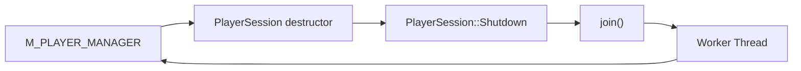

### Quy tắc

Không bao giờ:

```cpp
lock(managerMutex);
destroy(object);
```

nếu destructor của object có thể:

```text
join
callback
wait
I/O
GPU synchronization
SDL
MPV
```

### Thiết kế

Move object ra ngoài map trước:

```cpp
std::unique_ptr<PlayerSession> victim;

{
    std::lock_guard<std::mutex> lock(m_sessionsMutex);

    auto it = m_sessions.find(id);
    if (it != m_sessions.end()) {
        victim = std::move(it->second);
        m_sessions.erase(it);
    }
}

// destructor chạy ngoài mutex
victim.reset();
```

Đây là pattern cần áp dụng rộng rãi cho toàn project.

---

# 9. DEADLOCK HIGH — WindowManager::DestroyWindow

Code:

```cpp
void DestroyWindow(WindowId id)
{
    std::lock_guard<std::mutex> lock(m_windowsMutex);
    DestroyWindowInternal(id);
}
```

Trong `DestroyWindowInternal()`:

```cpp
DestroyWindowInternal(child->info.id);

...

windows.erase(it);
```

`windows.erase()` destroy:

```text
WindowRuntime
    ↓
UIRenderThread
    ↓
Stop()
    ↓
join()
```

Ngoài ra `WindowRuntime` chứa:

```text
graphicsBackend
uiRenderThread
renderer
controller
fontController
WindowResource
PropertyBag
sharedGroup
```

Do đó:

```text
M_WINDOW_MANAGER
      ↓
DestroyWindowInternal
      ↓
WindowRuntime destructor
      ↓
UIRenderThread::Stop()
      ↓
join()
      ↓
UI thread
      ↓
có thể truy cập manager
      ↓
M_WINDOW_MANAGER
```

Đây là deadlock/lifecycle hazard nghiêm trọng.

### Thiết kế chuẩn

Phase 1:

```text
lock WindowManager
    |
    +-- remove ownership
    +-- update map
unlock
```

Phase 2:

```text
destroy WindowRuntime
join threads
destroy GPU resources
destroy SDL resources
```

Tức:

```text
Manager Lock
    |
    +-- detach ownership
    |
Unlock
    |
Destroy Runtime
```

---

# 10. DEADLOCK/RACE — FontManager

## File

```text
src/FontManager.cpp
```

`GetSystemFontSet()`:

```cpp
std::lock_guard<std::mutex> lock(m_mutex);

...

EnsureFontDataLoaded(set.mainFont);
EnsureFontDataLoaded(set.cjkFont);
EnsureFontDataLoaded(set.iconFont);
EnsureFontDataLoaded(set.emojiFont);
```

Trong khi:

```cpp
EnsureFontDataLoaded()
```

hiện tại **không lock**.

Điều này tạo ra hai lựa chọn đều có vấn đề.

### Nếu giữ nguyên

```text
GetSystemFontSet
    |
    +-- M_FONT
    |
    +-- EnsureFontDataLoaded()
           |
           +-- ghi desc->fileData
```

`fileData` có thể bị thread khác truy cập.

=> **data race**.

### Nếu thêm lock vào EnsureFontDataLoaded

```text
GetSystemFontSet
    |
    +-- M_FONT
         |
         +-- EnsureFontDataLoaded
                |
                +-- M_FONT
```

`std::mutex` không recursive.

=> **self-deadlock**.

### Fix chuẩn

Không giữ global mutex trong I/O/lazy-load.

Thiết kế:

```text
lock
 |
 +-- tìm FontDescriptor
 |
 +-- copy shared_ptr
 |
unlock
 |
Load file
 |
publish atomically / lock descriptor
```

Tốt hơn nữa:

```text
FontRegistry mutex
FontData mutex
```

tách:

```text
M_FONT_REGISTRY
M_FONT_DATA
```

---

# 11. DEADLOCK RISK — ShaderManager

## File

```text
src/player/shaders/shader_manager.cpp
```

`ApplyPipeline()`:

```cpp
std::lock_guard<std::recursive_mutex> lock(mtx);
```

Sau đó thực hiện:

```cpp
fs::create_directories()
std::ofstream
GenerateTempShader()
mpv_command()
SaveState()
```

Đặc biệt:

```cpp
mpv_command(mpv, cmd);
```

được gọi dưới `M_SHADER`.

Graph:

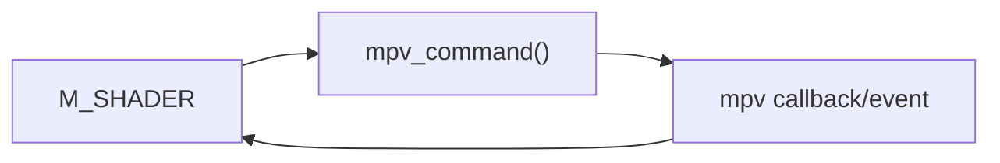

Không thể khẳng định `mpv_command()` sẽ synchronously quay lại `ShaderManager`, nhưng đây là lock boundary rất xấu.

### Nguyên tắc

Mutex chỉ bảo vệ:

```text
shaders
activeShaders
pipeline state
```

Không bảo vệ:

```text
filesystem
mpv_command
network
GPU
sleep
wait
join
callback
```

### Refactor

Phase 1:

```cpp
std::string command;
{
    std::lock_guard lock(mtx);

    // build shader list
    // update internal state
    command = ...
}

// ngoài lock
mpv_command(...);

// ngoài lock
SaveState();
```

---

# 12. DEADLOCK RISK — APIManager

## File

```text
src/api/api_manager.cpp
```

Code:

```cpp
void APIManager::SetProviderState(...)
{
    std::lock_guard<std::mutex> lock(m_queueMutex);

    m_providers[name]->SetState(state);
}
```

Vấn đề:

```text
M_API_QUEUE
   ↓
Provider::SetState()
   ↓
provider callback / logging / API manager
   ↓
M_API_QUEUE
```

Không nên gọi object external code khi giữ queue mutex.

### Fix

```cpp
std::shared_ptr<IAPIProvider> provider;

{
    std::lock_guard lock(m_queueMutex);

    auto it = m_providers.find(name);
    if (it != m_providers.end()) {
        provider = it->second;
    }
}

if (provider) {
    provider->SetState(state);
}
```

---

# 13. PlayerStateSystem — Callback dưới lock

## File

```text
src/player/PlayerStateSystem.h
```

Ví dụ:

```cpp
template<typename Func>
void WritePlayback(Func&& func) {
    std::unique_lock lock(m_playbackMutex);
    func(m_playback);
}
```

Tương tự:

```cpp
ReadPlayback()
ReadMedia()
ReadVideo()
ReadAudio()
ReadSubtitle()
ReadTrack()
ReadPlaylist()
ReadNetwork()
```

Đây là pattern:

```text
M_STATE_X
   ↓
user callback
```

Nếu callback gọi:

```cpp
ReadX()
WriteX()
GetFullState()
```

có thể self-deadlock.

Ví dụ:

```cpp
state.WritePlayback([&](auto& p) {
    auto x = state.GetPlaybackModel();
});
```

Graph:

```text
M_PLAYBACK
   ↓
callback
   ↓
M_PLAYBACK
```

### Quy tắc mới nên áp dụng

Callback API chỉ được dùng để mutate object, không được phép gọi ngược state system.

Tốt hơn:

```cpp
PlaybackModel snapshot;

{
    std::unique_lock lock(m_playbackMutex);
    modifier(m_playback);
    snapshot = m_playback;
}

NotifyPlaybackChanged(snapshot);
```

Nếu không cần callback thì giữ API hiện tại nhưng document rõ:

> Callback MUST NOT call any PlayerStateSystem API.

---

# 14. PlayerStateSystem — Multi-lock

`GetFullState()`:

```cpp
std::scoped_lock lock(
    m_playbackMutex,
    m_mediaMutex,
    m_videoMutex,
    m_audioMutex,
    m_subtitleMutex,
    m_trackMutex,
    m_playlistMutex,
    m_networkMutex
);
```

Điểm tốt:

`std::scoped_lock` sử dụng deadlock-avoidance algorithm của `std::lock`.

Do đó tốt hơn:

```cpp
lock(A);
lock(B);
```

ở nhiều thread.

### Tuy nhiên

Các API riêng lẻ vẫn cho phép code tạo thứ tự:

```text
Thread A:
M_PLAYBACK
    ↓
M_AUDIO

Thread B:
M_AUDIO
    ↓
M_PLAYBACK
```

Nếu tương lai có function lock nhiều state riêng lẻ, phải dùng:

```cpp
std::scoped_lock(m_playbackMutex, m_audioMutex);
```

thay vì:

```cpp
lock(m_playbackMutex);
lock(m_audioMutex);
```

---

# 15. UIRenderThread — lock giữ trong Graphics operation

## File

```text
src/windows/UIRenderThread.cpp
```

Đoạn:

```cpp
std::unique_lock lock(m_mutex);

m_cv.wait(lock, ...);

if (m_needsResize)
{
    m_graphicsBackend->Resize(...);
    m_needsResize = false;
}
```

`Resize()` được thực hiện trong khi:

```text
M_UI_RENDER
```

đang giữ.

Đây là anti-pattern vì `Resize()` là external subsystem.

Có thể xảy ra:

```text
M_UI_RENDER
   ↓
GraphicsBackend::Resize
   ↓
callback / event
   ↓
RequestResize
   ↓
M_UI_RENDER
```

### Fix

Copy request ra local:

```cpp
bool resize = false;
int w = 0;
int h = 0;

{
    std::unique_lock lock(m_mutex);

    m_cv.wait(lock, ...);

    resize = m_needsResize;
    w = m_newWidth;
    h = m_newHeight;

    m_needsResize = false;
    m_needsRender = false;
}

if (resize) {
    m_graphicsBackend->Resize(w, h);
}
```

---

# 16. PlayBackRenderThread — phần lock hiện tại khá tốt

## File

```text
src/player/render/PlayBackRenderThread.cpp
```

Đoạn:

```cpp
{
    std::unique_lock lock(this->state.mtx);

    this->state.cv.wait(lock, ...);

    ...

    localDrawW = this->state.surface.drawW;
    localDrawH = this->state.surface.drawH;
}
```

Đây là pattern tốt:

```text
LOCK
  ↓
WAIT
  ↓
COPY STATE
  ↓
UNLOCK
  ↓
GPU / MPV rendering
```

Đặc biệt code đã tránh:

```text
M_RENDER_THREAD
    ↓
mpv_render_context_render()
```

### Đây là pattern cần chuẩn hóa toàn project.

---

# 17. WindowRuntime::CaptureSnapshot — pattern tốt

## File

```text
src/windows/WindowRuntime.h
```

```cpp
std::shared_ptr<const WindowSnapshot> CaptureSnapshot() {
    std::lock_guard<std::mutex> lock(stateMutex);

    auto newSnapshot =
        std::make_shared<const WindowSnapshot>(state);

    m_currentSnapshot = newSnapshot;

    return m_currentSnapshot;
}
```

Điểm tốt:

```text
M_WINDOW_STATE
    ↓
copy state
    ↓
unlock
    ↓
render snapshot
```

Render không cần giữ `stateMutex`.

Đây là hướng nên mở rộng.

---

# 18. WindowProcHook — nhìn chung đã cải thiện

## File

```text
src/windows/WindowProcHook.cpp
```

Ví dụ `WM_NCLBUTTONUP`:

```cpp
{
    std::lock_guard<std::mutex> lock(runtime->stateMutex);

    hit = runtime->state.input.lastHit;
    ...
}

switch (hit) {
    ...
    runtime->controller->Close();
}
```

Đây là thiết kế tốt vì:

```text
lock state
    ↓
copy input state
    ↓
unlock
    ↓
controller action
```

Đặc biệt điều này tránh vấn đề trước đây:

```text
stateMutex
    ↓
SendMessage / controller
    ↓
WndProc
    ↓
stateMutex
```

### Đây là pattern cần giữ nguyên.

---

# 19. Lock Graph của Window subsystem

Lock graph khuyến nghị hiện tại:

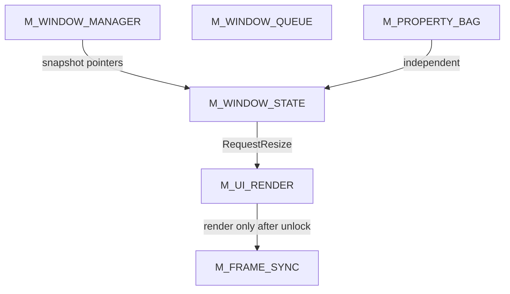

Không nên tồn tại:

```text
M_WINDOW_MANAGER
        ↓
M_WINDOW_STATE
```

trừ những function thực sự cần.

Và tuyệt đối tránh:

```text
M_WINDOW_MANAGER
        ↓
destructor
        ↓
join
```

---

# 20. Lock Graph của Player subsystem

Lock graph mục tiêu:

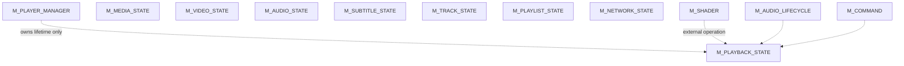

Quan trọng:

> `M_PLAYER_MANAGER` chỉ nên bảo vệ map/session ownership. Nó không được giữ trong khi chạy session code.

---

# 21. Lock Graph của Settings

Lock graph hiện tại:

```text
M_SETTINGS
   |
   +--> Notify
          |
          +--> Callback
                  |
                  +--> M_SETTINGS
```

Đây là cycle.

Lock graph mục tiêu:

```text
M_SETTINGS
   |
   +--> copy listeners
   |
UNLOCK
   |
callback
   |
M_SETTINGS
```

---

# 22. Lock Graph của Thread Lifecycle

### Hiện tại — nguy hiểm

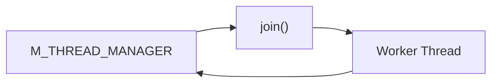

### Mục tiêu

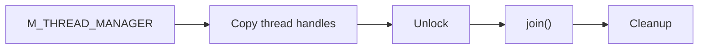

---

# 23. Deadlock Patterns cần cấm toàn project

## Rule 1 — Không callback dưới mutex

Cấm:

```cpp
std::lock_guard lock(mutex);

callback();
```

Thay bằng:

```cpp
std::vector<Callback> callbacks;

{
    std::lock_guard lock(mutex);
    callbacks = listeners;
}

for (auto& cb : callbacks) {
    cb();
}
```

---

## Rule 2 — Không destructor dưới mutex

Cấm:

```cpp
std::lock_guard lock(mutex);
objects.erase(it);
```

nếu object destructor phức tạp.

Dùng:

```cpp
std::unique_ptr<Object> victim;

{
    std::lock_guard lock(mutex);
    victim = std::move(it->second);
    objects.erase(it);
}

victim.reset();
```

---

## Rule 3 — Không join dưới mutex

Cấm:

```cpp
std::lock_guard lock(mutex);
thread.join();
```

---

## Rule 4 — Không gọi external subsystem dưới mutex

External subsystem gồm:

```text
SDL
Win32
OpenGL
mpv
filesystem
network
audio backend
GPU
callbacks
condition wait
join
sleep
```

---

## Rule 5 — Không giữ state mutex trong render

Cấm:

```text
M_WINDOW_STATE
    ↓
OpenGL
    ↓
ImGui
    ↓
MPV
```

Render phải dùng snapshot.

---

## Rule 6 — Không dùng recursive_mutex để chữa lock design

`recursive_mutex` chỉ giải quyết:

```text
A()
 └── A()
```

Nó **không giải quyết**:

```text
Thread A:
M1 → M2

Thread B:
M2 → M1
```

Ví dụ `PropertyBag` dùng:

```cpp
std::recursive_mutex
```

có thể hợp lý nếu API thực sự cần recursion, nhưng không nên coi đó là giải pháp chung cho deadlock.

---

# 24. Lock Ordering Policy đề xuất

Project nên định nghĩa lock hierarchy chính thức.

Ví dụ:

```text
LEVEL 10
M_THREAD_MANAGER

LEVEL 20
M_PLAYER_MANAGER
M_WINDOW_MANAGER

LEVEL 30
M_WINDOW_STATE
M_PLAYER_STATE_*

LEVEL 40
M_SETTINGS
M_PROPERTY_BAG

LEVEL 50
M_UI_RENDER
M_RENDER_THREAD

LEVEL 60
M_SHADER
M_FONT
M_AUDIO_LIFECYCLE
```

Nhưng quan trọng hơn:

> Một subsystem manager không được giữ lock rồi gọi xuống subsystem thấp hơn nếu subsystem thấp hơn có khả năng callback ngược.

Tốt nhất:

```text
Manager lock
    ↓
lookup
    ↓
copy pointer / snapshot
    ↓
unlock
    ↓
execute operation
```

---

# 25. Quy tắc Lock Acquisition

Mọi function mới có nhiều mutex phải tuân thủ:

```text
A → B → C
```

không được có:

```text
A → B
```

ở function này và:

```text
B → A
```

ở function khác.

Ví dụ cấm:

```cpp
Thread 1:
lock(WindowManager);
lock(PlayerManager);
```

và:

```cpp
Thread 2:
lock(PlayerManager);
lock(WindowManager);
```

Nếu bắt buộc lock nhiều mutex:

```cpp
std::scoped_lock lock(m_windowsMutex, m_sessionsMutex);
```

hoặc tránh giữ cả hai bằng snapshot.

---

# 26. Bảng Audit chi tiết

| File | Lock | Hành động dưới lock | Đánh giá |
|---|---|---|---|
| `threads/thread_manager.cpp` | `mutex_` | `join()` | **CRITICAL** |
| `settings_manager.h` | `rwMutex` | callback | **CRITICAL** |
| `windows/WindowManager.h` | `m_windowsMutex` | `onCreated()` | **HIGH** |
| `windows/WindowManager.h` | `m_windowsMutex` | destroy object | **HIGH** |
| `player/session/PlayerManager.cpp` | `m_sessionsMutex` | `PlayerSession::Init()` | **HIGH** |
| `player/session/PlayerManager.cpp` | `m_sessionsMutex` | Session destructor | **HIGH** |
| `FontManager.cpp` | `m_mutex` | lazy file load | **HIGH/RACE** |
| `shader_manager.cpp` | `mtx` | `mpv_command()` | **MEDIUM/HIGH** |
| `shader_manager.cpp` | `mtx` | filesystem I/O | **MEDIUM** |
| `UIRenderThread.cpp` | `m_mutex` | graphics resize | **MEDIUM** |
| `api_manager.cpp` | `m_queueMutex` | provider callback | **MEDIUM** |
| `PlayerStateSystem.h` | state mutex | user callback | **MEDIUM** |
| `WindowProcHook.cpp` | `stateMutex` | state only | **GOOD** |
| `UpdateWindowState.h` | `stateMutex` | state snapshot | **GOOD** |
| `PlayBackRenderThread.cpp` | `state.mtx` | state snapshot | **GOOD** |
| `WindowRuntime.h` | `stateMutex` | snapshot creation | **GOOD** |
| `ring_buffer.h` | `m_mutex` | buffer operation | **GOOD** |
| `APIManager.cpp` | `m_queueMutex` | queue extraction | **GOOD** |

---

# 27. Những lock hiện tại KHÔNG phải deadlock trực tiếp

Các trường hợp sau nhìn chung đang đúng:

## ThreadSafeRingBuffer

```cpp
unique_lock(m_mutex);
wait(...);
push_unsafe();
unlock();
notify();
```

Đây là pattern chuẩn.

---

## PlayBackRenderThread

```cpp
unique_lock(state.mtx);
cv.wait(...);
copy state;
```

Sau đó render ngoài lock.

**Tốt.**

---

## WindowRuntime snapshot

```cpp
lock(stateMutex);
copy state;
unlock();
render(snapshot);
```

**Tốt.**

---

## WindowProcHook

State lock chỉ bao quanh state mutation, sau đó controller action ngoài lock.

**Tốt.**

---

## PlayerStateSystem::GetFullState

```cpp
std::scoped_lock(...)
```

tốt hơn nhiều mutex acquisition thủ công.

---

# 28. Deadlock Chain nguy hiểm nhất của toàn hệ thống

Chuỗi cần đặc biệt theo dõi:

```text
MAIN THREAD
    |
    +-- WindowManager
    |
    +-- PlayerManager
    |
    +-- PlayerSession
    |
    +-- RenderThread
    |
    +-- Audio
    |
    +-- MPV
```

Nếu shutdown được thực hiện như:

```text
WindowManager lock
    ↓
destroy WindowRuntime
    ↓
destroy PlayerSession
    ↓
join RenderThread
```

trong khi worker thread:

```text
RenderThread
    ↓
PlayerManager
    ↓
WindowManager
```

sẽ hình thành:

```text
WindowManager
      ↓
join(RenderThread)
      ↓
RenderThread
      ↓
PlayerManager
      ↓
WindowManager
```

Đây là cycle điển hình cần loại bỏ.

---

# 29. Kiến trúc shutdown đề xuất

Shutdown nên chia thành 4 phase.

## Phase A — Stop accepting new work

```text
running = false
acceptCommands = false
acceptWindowCreation = false
```

## Phase B — Detach ownership

```text
WindowManager
    ↓
remove WindowRuntime from map

PlayerManager
    ↓
remove PlayerSession from map
```

Không destructor dưới manager mutex.

## Phase C — Stop workers

```text
UIRenderThread::Stop()
PlayBackRenderThread::Stop()
Audio::Shutdown()
APIManager::Shutdown()
```

Không giữ manager lock.

## Phase D — Destroy resources

```text
MPV
OpenGL
ImGui
SDL
Window
Font
Shader
```

---

# 30. Shutdown Graph mục tiêu

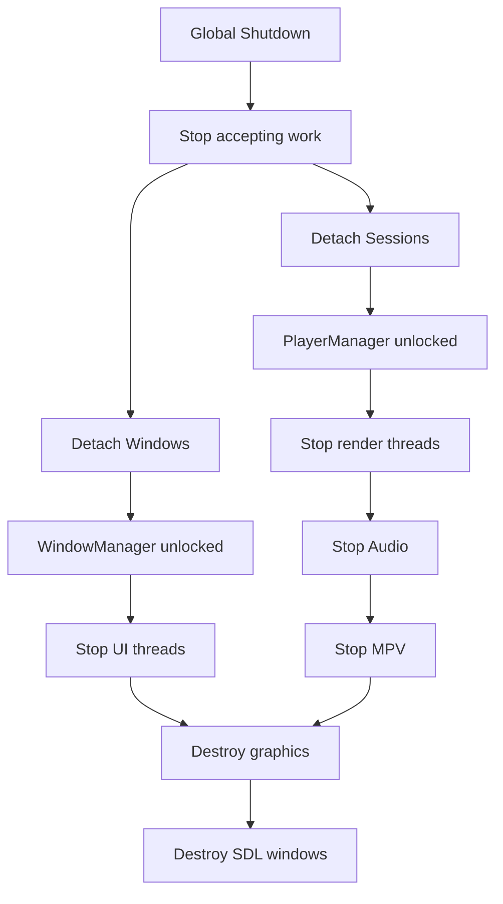

---

# 31. Refactor Priority

## Phase 0 — bắt buộc trước khi debug flicker

Sửa:

```text
1. ThreadManager::JoinAllRegistered
2. ConfigManager::Notify
3. WindowManager::QueueCreateWindow
4. PlayerManager::DestroySession
5. WindowManager::DestroyWindow
```

Đây là các điểm có khả năng biến một lỗi timing thành **hard deadlock**.

---

## Phase 1 — lifecycle

Refactor:

```text
PlayerManager
WindowManager
ThreadManager
UIRenderThread
PlayBackRenderThread
```

Mục tiêu:

```text
No join while manager lock
No destructor while manager lock
No callback while manager lock
```

---

## Phase 2 — state

Chuẩn hóa:

```text
WindowSnapshot
PlayerStateSnapshot
AudioSnapshot
RenderSnapshot
```

Mục tiêu:

```text
lock
 ↓
copy
 ↓
unlock
 ↓
work
```

---

## Phase 3 — external operations

Tách:

```text
mutex-protected state mutation
```

khỏi:

```text
SDL
Win32
OpenGL
MPV
filesystem
network
audio
```

---

## Phase 4 — lock hierarchy

Tạo header/document:

```text
LOCK_HIERARCHY.md
```

Mỗi mutex phải có:

```text
Name
Owner
Purpose
Allowed callers
Acquisition level
May call external code?
May wait?
May join?
```

---

# 32. Lock Contract đề xuất

Ví dụ:

```cpp
/**
 * LOCK CONTRACT
 *
 * M_WINDOW_MANAGER:
 * - Protects windows map only.
 * - NEVER call user callback while held.
 * - NEVER destroy WindowRuntime while held.
 * - NEVER join a thread while held.
 * - NEVER call SDL/Win32 while held.
 */
```

Tương tự:

```cpp
/**
 * M_PLAYER_MANAGER:
 * - Protects session map only.
 * - NEVER initialize PlayerSession while held.
 * - NEVER destroy PlayerSession while held.
 * - NEVER call PlayerSession methods while held.
 */
```

---

# 33. Dynamic Lock Graph Instrumentation

Static analysis chỉ cho biết khả năng.

Để bắt deadlock thực tế, nên thêm debug lock tracker.

Mỗi lock acquisition ghi:

```text
Thread ID
Lock ID
Timestamp
Source file
Line
Current held locks
```

Ví dụ log:

```text
[T1234]
LOCK M_WINDOW_MANAGER
LOCK M_PLAYER_MANAGER
```

Nếu thread khác:

```text
[T5678]
LOCK M_PLAYER_MANAGER
LOCK M_WINDOW_MANAGER
```

tool có thể phát hiện:

```text
M_WINDOW_MANAGER → M_PLAYER_MANAGER
M_PLAYER_MANAGER → M_WINDOW_MANAGER
```

=> cycle.

---

# 34. Runtime Lock Graph

Dữ liệu runtime nên được xây:

```text
Thread
  |
  +-- holds Lock A
  |
  +-- waits Lock B
```

Ví dụ:

```text
Thread-UI
    HOLD: M_WINDOW_MANAGER
    WAIT: M_PLAYER_MANAGER

Thread-MPV
    HOLD: M_PLAYER_MANAGER
    WAIT: M_WINDOW_MANAGER
```

Graph:

```text
UI
 ├── HOLD WM
 └── WAIT PM

MPV
 ├── HOLD PM
 └── WAIT WM
```

Cycle:

```text
WM → PM → WM
```

=> deadlock.

---

# 35. Quy tắc kiểm tra code review

Mỗi lần thêm:

```cpp
std::lock_guard
std::unique_lock
std::shared_lock
std::scoped_lock
```

phải trả lời 7 câu hỏi:

```text
1. Lock bảo vệ dữ liệu nào?
2. Function có gọi function khác không?
3. Function đó có lấy lock khác không?
4. Có callback không?
5. Có join/wait không?
6. Có SDL/Win32/OpenGL/MPV không?
7. Có destructor/reset/erase object không?
```

Nếu câu 4–7 là YES:

> Phải xem lại lock scope.

---

# 36. Kết luận cuối cùng

Project hiện tại **không có dấu hiệu một single mutex gây toàn bộ deadlock**.

Vấn đề lớn hơn là kiến trúc lock đang có dạng:

```text
Manager Lock
    ↓
Object Operation
    ↓
Subsystem
    ↓
Thread / callback / external API
    ↓
Manager Lock
```

Đây là pattern phải loại bỏ.

Các điểm cần sửa theo thứ tự:

```text
CRITICAL
│
├── ThreadManager::JoinAllRegistered()
│
└── ConfigManager::Notify()
        │
HIGH    │
├── WindowManager::QueueCreateWindow()
├── WindowManager::DestroyWindow()
├── PlayerManager::CreateSession()
├── PlayerManager::DestroySession()
└── FontManager::GetSystemFontSet()
        │
MEDIUM  │
├── ShaderManager::ApplyPipeline()
├── UIRenderThread::Run()
├── APIManager::SetProviderState()
└── PlayerStateSystem callback APIs
```

### Kiến trúc lock nên hướng tới

```text
                 ┌─────────────────────┐
                 │  Manager / Registry │
                 └──────────┬──────────┘
                            │
                       lock briefly
                            │
                     copy ownership
                            │
                         unlock
                            │
             ┌──────────────┴──────────────┐
             │                             │
       worker/thread                 external subsystem
             │                             │
       join/stop/render             SDL/MPV/OpenGL/I/O
```

Thay vì:

```text
LOCK
 ↓
everything
 ↓
callback
 ↓
join
 ↓
external API
 ↓
UNLOCK
```

**Đây là thay đổi kiến trúc quan trọng nhất để giải quyết nhóm lỗi deadlock, freeze cửa sổ, treo khi resize/close và crash trong shutdown của Im_player.**

---

# 37. Checklist triển khai

- [ ] Sửa `ThreadManager::JoinAllRegistered()`.
- [ ] Sửa `ConfigManager::Notify()` để callback chạy ngoài lock.
- [ ] Sửa `WindowManager::QueueCreateWindow()` để `onCreated()` chạy ngoài lock.
- [ ] Sửa `WindowManager::DestroyWindow()` để detach ownership trước khi destroy.
- [ ] Sửa `PlayerManager::DestroySession()` để Session destructor chạy ngoài `m_sessionsMutex`.
- [ ] Refactor `PlayerManager::CreateSession()` để không giữ manager lock trong `PlayerSession::Init()`.
- [ ] Tách `FontManager` registry lock khỏi font-data loading.
- [ ] Đưa `mpv_command()` ra ngoài `ShaderManager::mtx`.
- [ ] Đưa graphics `Resize()` ra ngoài `UIRenderThread::m_mutex`.
- [ ] Đưa provider callback/action ra ngoài `APIManager::m_queueMutex`.
- [ ] Cấm callback gọi lại `PlayerStateSystem` khi đang giữ state lock.
- [ ] Xây `LOCK_HIERARCHY.md`.
- [ ] Thêm runtime lock-order detector ở Debug build.
- [ ] Test riêng `resize + second window + close + shutdown`.
- [ ] Test `window destroy + render thread join`.
- [ ] Test `session destroy + MPV callback`.
- [ ] Test `SDL_QUIT + simultaneous render threads`.
- [ ] Test `ConfigManager callback recursion`.
- [ ] Test `ThreadManager JoinAllRegistered()` khi worker đang gọi `ThreadManager`.

# 38. Verdict

**Đánh giá hiện tại:**

```text
Thread safety              : ⚠️ MEDIUM / HIGH RISK
Deadlock risk              : 🔴 HIGH
Lifecycle locking          : 🔴 HIGH
Callback-under-lock        : 🔴 HIGH
Join-under-lock            : 🔴 CRITICAL
Window state locking       : 🟡 ĐANG CẢI THIỆN
Render snapshot design     : 🟢 TỐT
Render CV locking          : 🟢 KHÁ TỐT
Ring buffer locking        : 🟢 TỐT
Multi-state scoped_lock    : 🟢 TỐT
Global lock hierarchy      : 🔴 CHƯA CÓ
Runtime lock instrumentation: 🔴 CHƯA CÓ
```

**Ưu tiên tuyệt đối không phải thêm `recursive_mutex`.**

Ưu tiên đúng là:

```text
SHORT LOCK
    ↓
SNAPSHOT / DETACH
    ↓
UNLOCK
    ↓
CALL / JOIN / RENDER / MPV / SDL
```

Đó mới là nền tảng để tiếp tục xử lý triệt để các hiện tượng **deadlock, cửa sổ đóng băng khi resize, treo khi tạo cửa sổ thứ hai và hang lúc shutdown**.